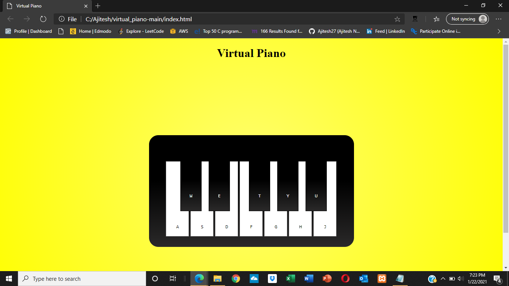

# virtual_piano
A simple implementation of a piano using HTML, CSS and JavaScript which can be accessed on any browser.
  
Just click on the keys and listen to the melody. 
  

## Demo
<a href="https://rickscode.github.io/virtual_piano/" rel="nofollow">Live Demo</a>

## Screen

## Technologies
Built with:
* HTML
* CSS
* JavaScript

## Features
* 12 responsive keys
* Keyboard, Touchscreen and Click controls